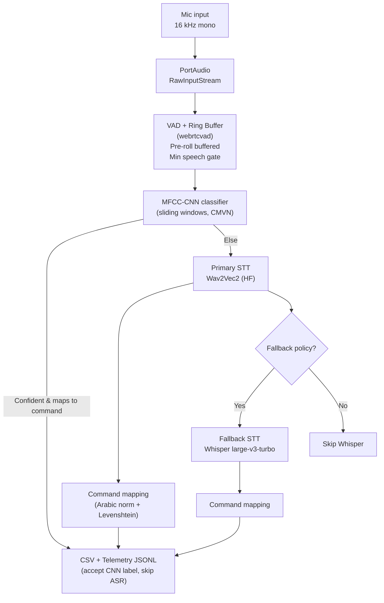
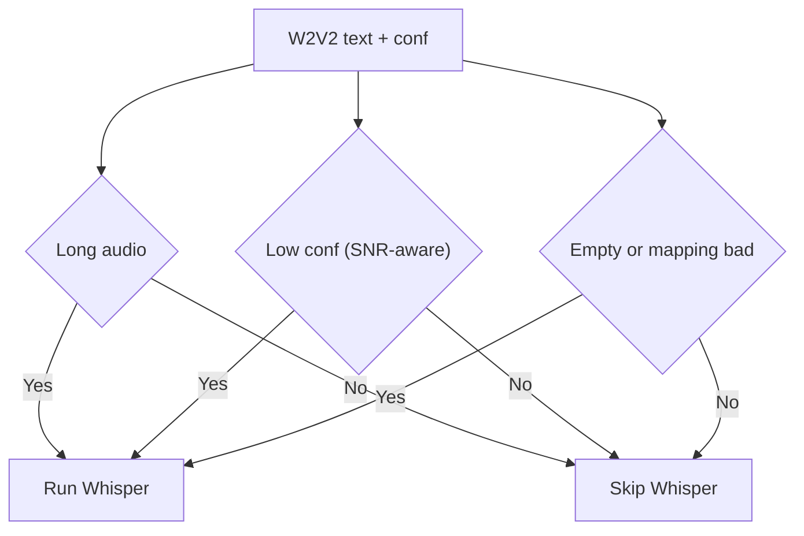

# Arabic Command Comparator – System Report

This document explains the full workflow, components, policies, and tuning knobs of the Arabic short-command system. It covers both GUI and CLI runners.

## High-level pipeline



## Components

- Audio capture: `sounddevice.RawInputStream` at 16 kHz, mono, int16.
- VAD + ring buffer: `webrtcvad` processes fixed-size frames, keeps pre-roll (ring buffer), gates too-short utterances, writes a VAD-trimmed temp WAV.
- MFCC-CNN front-end classifier:
  - Features: MFCC or Log-Mel with CMVN; optional deltas.
  - Inference: sliding 1s windows with overlap; average softmax scores.
  - Policy: if confidence ≥ threshold and label maps to a known command, accept and skip heavy ASR.
- Primary STT: Wav2Vec2 (Hugging Face), Arabic model (default `elgeish/wav2vec2-large-xlsr-53-arabic`). Confidence = mean of max softmax over frames.
- Fallback STT: faster-whisper (`large-v3-turbo`), device/compute-type per config (CPU int8 by default).
- Command mapping: Arabic normalization + Levenshtein snapping to `config.COMMANDS`, with a max edit distance cap.
- Logging: enforced-schema CSV and JSONL telemetry; offline ROC-like script for KWS threshold tuning.

## CLI run sequence

```mermaid
sequenceDiagram
  participant U as User (keyboard)
  participant CLI as CLI runner
  participant Rec as Recorder
  participant VAD as VAD/Ring
  participant CNN as MFCC-CNN
  participant W2V2 as Wav2Vec2
  participant WH as Whisper
  participant CSV as CSV/Telemetry

  U->>CLI: r (start)
  CLI->>Rec: start()
  U->>CLI: s (stop)
  CLI->>Rec: stop (stream only)
  CLI->>VAD: record_with_vad() → vad_trim.wav
  CLI->>CNN: sliding-window predict(vad_trim.wav)
  alt confident & maps
    CLI->>CSV: write CNN-only row
    CLI-->>U: print "CNN accepted; skipping ASR"
  else
    CLI->>W2V2: transcribe_with_confidence()
    W2V2-->>CLI: text, conf
    CLI->>CLI: map_to_commands()
    CLI->>WH: transcribe() [if fallback policy triggers]
    WH-->>CLI: text
    CLI->>CLI: map_to_commands()
    CLI->>CSV: append full row
    CLI-->>U: print summary lines
  end
```

<!-- KWS section removed -->

## Fallback policy (mapping-aware)

- Whisper runs when any of the following is true:
  - Duration ≥ `WHISPER_FALLBACK_LONG_MS`.
  - W2V2 confidence < `W2V2_CONF_THRESHOLD` (stricter if SNR < `SNR_LOW_DB`).
  - W2V2 text empty.
  - W2V2 text failed command mapping and normalized distance > 0.35.



## Command mapping

- Arabic normalization: remove diacritics and tatweel, normalize (إ/أ/آ→ا, ى→ي, ة→ه), collapse spaces.
- Levenshtein distance to each candidate in `config.COMMANDS`; select best within `CMD_MAP_MAX_DISTANCE`.
- Mapped outputs are written as `wav2vec2_mapped` / `whisper_mapped`.

## Data outputs

- CSV (schema enforced, auto-rotate legacy):
  - `timestamp, audio_file, audio_duration_ms, mfcc_label, mfcc_confidence, mfcc_used, wav2vec2, w2v2_confidence, wav2vec2_mapped, whisper_turbo, whisper_used, whisper_mapped, wav2vec2_time_ms, whisper_time_ms, total_processing_time_ms`.
- Telemetry JSONL (`results/telemetry.jsonl`): CNN/ASR details, duration, SNR per sample.

## Terminology (quick)

- MFCC (Mel-Frequency Cepstral Coefficients): compact spectral features computed per short frame (e.g., 25 ms) that capture the phonetic shape of speech; standard for ASR front-ends.
- CMVN (Cepstral Mean and Variance Normalization): per-utterance normalization making each feature dimension zero-mean, unit-variance.
- Thresholds:
  - W2V2_CONF_THRESHOLD: minimum Wav2Vec2 confidence; below triggers Whisper (especially if SNR is poor).
  - WHISPER_FALLBACK_LONG_MS: duration above which Whisper is preferred for final accuracy.
  - CMD_MAP_MAX_DISTANCE: max Levenshtein distance to snap to a known command.

## Configuration (env / `config.py`)

- Audio: `SAMPLE_RATE, VAD_AGGRESSIVENESS, VAD_FRAME_MS, RING_BUFFER_MS, MIN_SPEECH_MS`.
- STT:
  - W2V2: `W2V2_MODEL_ID, STT_DEVICE`.
  - Whisper: `WHISPER_MODEL, WHISPER_COMPUTE_TYPE`.
- Fallback policy: `WHISPER_FALLBACK_LONG_MS, W2V2_CONF_THRESHOLD, SNR_LOW_DB, ALWAYS_RUN_WHISPER`.
- Commands: `COMMANDS, CMD_MAP_MAX_DISTANCE`.
- Logging: `RESULTS_CSV, TELEMETRY_PATH`.

## CLI vs GUI

- GUI (Tkinter): press-and-hold button; results pane mirrors CSV fields.
- CLI: `python cli.py` → r=start, s=stop, q=quit; prints CNN/ASR summaries and appends CSV/telemetry.

## Tuning guidance

- Fallback: if W2V2 is often slightly off, lower the mapping cutoff or enrich `COMMANDS` with variants. If latency is higher than desired, raise `WHISPER_FALLBACK_LONG_MS`.
- VAD: increase `VAD_AGGRESSIVENESS` in noisy rooms; adjust `MIN_SPEECH_MS` to reduce spurious short clips.

## References

- Apple Hey Siri: on-device voice trigger design and temporal integration concepts (background reading).
  - Hey Siri: https://machinelearning.apple.com/research/hey-siri
  - Voice Trigger: https://machinelearning.apple.com/research/voice-trigger
- Real-time vs turn-based voice agents: streaming design choices.
  - Softcery guide: https://softcery.com/lab/ai-voice-agents-real-time-vs-turn-based-tts-stt-architecture/

