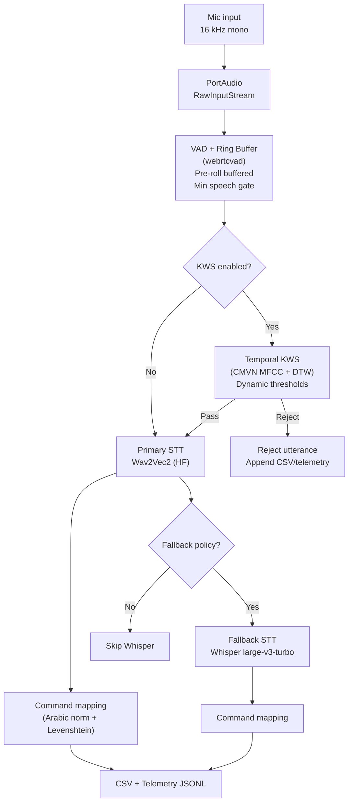
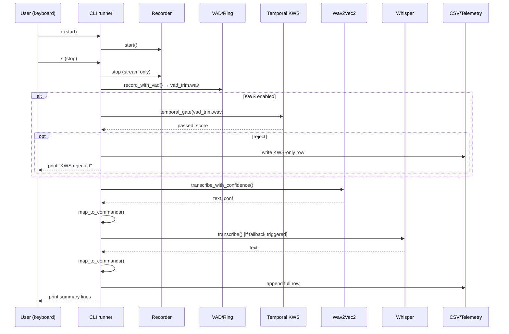
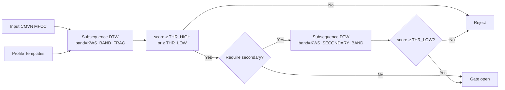
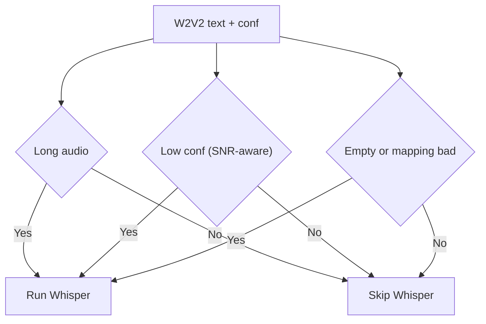

# Arabic Command Comparator – System Report

This document explains the full workflow, components, policies, and tuning knobs of the Arabic short-command system. It covers both GUI and CLI runners.

## High-level pipeline

## Components

- Audio capture: `sounddevice.RawInputStream` at 16 kHz, mono, int16.
- VAD + ring buffer: `webrtcvad` processes fixed-size frames, keeps pre-roll (ring buffer), gates too-short utterances, writes a VAD-trimmed temp WAV.
- KWS (wake-word):
  - Templates: CMVN-normalized MFCCs from `kws/templates/<profile>/*.wav`.
  - Scoring: subsequence DTW with Sakoe–Chiba band (cosine frame distance), score mapped to [0,1] via 1/(1+d).
  - Temporal/dynamic gating: primary high/low thresholds; optional secondary checker with stricter band.
- Primary STT: Wav2Vec2 (Hugging Face), Arabic model (default `elgeish/wav2vec2-large-xlsr-53-arabic`). Confidence = mean of max softmax over frames.
- Fallback STT: faster-whisper (`large-v3-turbo`), device/compute-type per config (CPU int8 by default).
- Command mapping: Arabic normalization + Levenshtein snapping to `config.COMMANDS`, with a max edit distance cap.
- Logging: enforced-schema CSV and JSONL telemetry; offline ROC-like script for KWS threshold tuning.

## CLI run sequence

## KWS details (temporal + dynamic)

- Templates per profile: `kws/templates/<profile>/*.wav` (enrolled via GUI checkbox or by dropping WAVs).
- Scoring: CMVN MFCC → subsequence DTW with band constraint; min distance → score = 1/(1+d).
- Temporal/dynamic thresholds:
  - Primary pass if `score ≥ KWS_THR_HIGH` or `score ≥ KWS_THR_LOW`.
  - Optional secondary checker with narrower band must also pass.
- SNR-aware thresholding is supported in KWS classic gate (optional), and dynamic thresholds concept aligns with Apple’s approach.

## Fallback policy (mapping-aware)

- Whisper runs when any of the following is true:
  - Duration ≥ `WHISPER_FALLBACK_LONG_MS`.
  - W2V2 confidence < `W2V2_CONF_THRESHOLD` (stricter if SNR < `SNR_LOW_DB`).
  - W2V2 text empty.
  - W2V2 text failed command mapping and normalized distance > 0.35.

## Command mapping

- Arabic normalization: remove diacritics and tatweel, normalize (إ/أ/آ→ا, ى→ي, ة→ه), collapse spaces.
- Levenshtein distance to each candidate in `config.COMMANDS`; select best within `CMD_MAP_MAX_DISTANCE`.
- Mapped outputs are written as `wav2vec2_mapped` / `whisper_mapped`.

## Data outputs

- CSV (schema enforced, auto-rotate legacy):
  - `timestamp, audio_file, audio_duration_ms, kws_passed, kws_score, wav2vec2, w2v2_confidence, wav2vec2_mapped, whisper_turbo, whisper_used, whisper_mapped, wav2vec2_time_ms, whisper_time_ms, total_processing_time_ms`.
- Telemetry JSONL (`results/telemetry.jsonl`): KWS/ASR details, duration, SNR per sample.
- Offline ROC-like script: `analysis_roc.py` sweeps KWS thresholds and prints precision/recall/FPR to guide choosing `KWS_THR_HIGH/LOW`.

## Terminology (quick)

- MFCC (Mel-Frequency Cepstral Coefficients): compact spectral features computed per short frame (e.g., 25 ms) that capture the phonetic shape of speech; standard for KWS/ASR front-ends.
- CMVN (Cepstral Mean and Variance Normalization): per-utterance normalization making each MFCC dimension zero-mean, unit-variance; reduces channel and loudness effects, improving template matching.
- Thresholds:
  - KWS_THR_HIGH / KWS_THR_LOW: dynamic wake thresholds; pass if score ≥ HIGH (confident) or ≥ LOW (borderline). Tune via telemetry/ROC.
  - KWS_BAND_FRAC / KWS_SECONDARY_BAND_FRAC: DTW band widths; lower is stricter (secondary checker is narrower).
  - W2V2_CONF_THRESHOLD: minimum Wav2Vec2 confidence; below triggers Whisper (especially if SNR is poor).
  - WHISPER_FALLBACK_LONG_MS: duration above which Whisper is preferred for final accuracy.
  - CMD_MAP_MAX_DISTANCE: max Levenshtein distance to snap to a known command.

## Configuration (env / `config.py`)

- Audio: `SAMPLE_RATE, VAD_AGGRESSIVENESS, VAD_FRAME_MS, RING_BUFFER_MS, MIN_SPEECH_MS`.
- KWS: `KWS_ENABLED, KWS_TEMPLATES_DIR, KWS_PROFILE_ID, KWS_THR_HIGH/LOW, KWS_BAND_FRAC, KWS_SECONDARY_BAND_FRAC`.
- STT:
  - W2V2: `W2V2_MODEL_ID, STT_DEVICE`.
  - Whisper: `WHISPER_MODEL, WHISPER_COMPUTE_TYPE`.
- Fallback policy: `WHISPER_FALLBACK_LONG_MS, W2V2_CONF_THRESHOLD, SNR_LOW_DB, ALWAYS_RUN_WHISPER`.
- Commands: `COMMANDS, CMD_MAP_MAX_DISTANCE`.
- Logging: `RESULTS_CSV, TELEMETRY_PATH`.

## CLI vs GUI

- GUI (Tkinter): press-and-hold button, enrollment checkbox, profile field; results pane mirrors CSV fields.
- CLI: `python cli.py` → r=start, s=stop, q=quit; prints KWS/ASR summaries and appends CSV/telemetry.

## Tuning guidance

- KWS: use ROC script to balance FP (false wakes) vs FN (misses). Start with `KWS_THR_HIGH≈0.70`, `KWS_THR_LOW≈0.60`, then refine with more data.
- Fallback: if W2V2 is often slightly off, lower the mapping cutoff or enrich `COMMANDS` with variants. If latency is higher than desired, raise `WHISPER_FALLBACK_LONG_MS`.
- VAD: increase `VAD_AGGRESSIVENESS` in noisy rooms; adjust `MIN_SPEECH_MS` to reduce spurious short clips.

## References

- Apple Hey Siri: dynamic thresholds and temporal integration.
  - Hey Siri: https://machinelearning.apple.com/research/hey-siri
  - Voice Trigger: https://machinelearning.apple.com/research/voice-trigger
- Real-time vs turn-based voice agents: streaming design choices.
  - Softcery guide: https://softcery.com/lab/ai-voice-agents-real-time-vs-turn-based-tts-stt-architecture/

